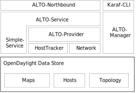
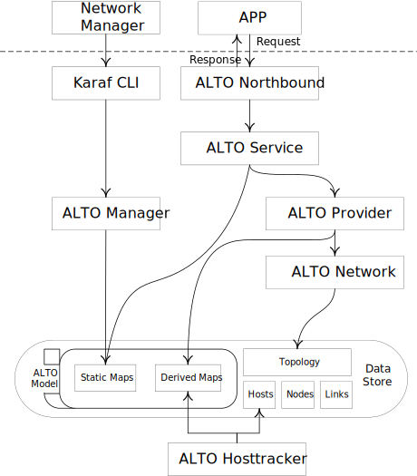

# ALTO Design Overview

## The current status of ALTO

ALTO still in developing as a part of OpenDayLight. It provides the services defined in [RFC7285](https://tools.ietf.org/html/rfc7285). But now ALTO has some limitations: the IRD and cost map mast be loaded manually and the endpoints cost service depends on a self-modified L2Switch. 

## Architecture

This section will introduces the architecture of ALTO.

### Overview

### The work flow in ALTO

### The modules in ALTO

- alto-common: Provides the base utilities for ALTO. It contains the exceptions, RFC JSON/YANG JSON converters and other utilities.
- alto-extensions: Not been used in current ALTO.
- alto-hosttracker: tracks hosts in the topology and generates network map for ALTO.
- alto-manager: Warpper for ALTO in karaf. Provide `alto:create`, `alto:delete` and other commands.
- alto-model: Defines the YANG models used in ALTO and the initializer for generated java codes.
- alto-network: Provides network related functions. Such as the readers of flow table, topology. And the utilities may be used by endpoints cost service. 
- alto-northbound: Provides the northbound restful services by jersey.
- alto-provider: Provides a basic implementation of endpoints cost service.
- alto-service: Defines the interface of services in ALTO.

### IRD

IRD provides the index of ALTO services. Now IRD could not be generated automaticlly so user should load it from restconf.

### Network Map

Network map could be generated by `alto-hosttracker`.

### Cost Map

Cost map has not been implemented.

### ECS

`alto-provider` has a basic ECS implementation. Click [here](./ECS_design_document.md) for more information.

### EPS

Not implemented in current ALTO.

## Missing parts

