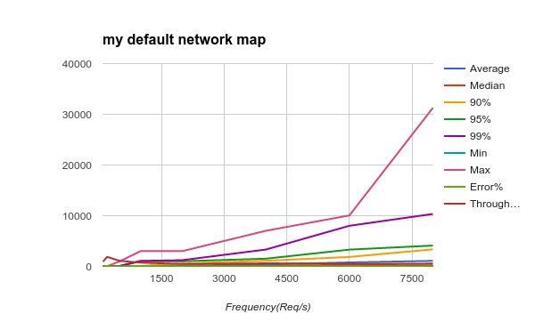
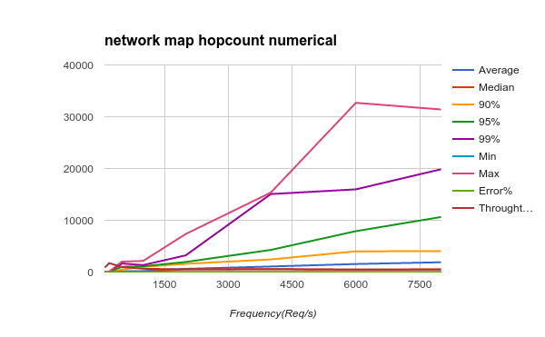
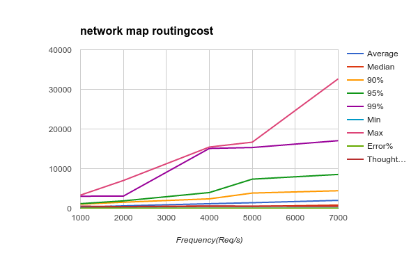
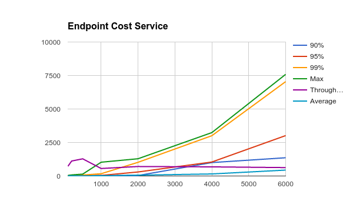

# **Performance Test Report**

The Performance Test has been done with Alto Endpoint Cost Service and other service(Map Routing Cost Service, Network Hopcount Numerical Service , etc.). 

We use mininet as a virtual network, and the network was set as a binary tree, whose depth is 8.(256 Nodes and 255 switches). Based on the virtual network, our test began with the frequency 100 Requests/s. Alto Service performs well at that situation.Therefore, a growing pressure was exerted on the server in order to test its limit.

The test is made up for 4 parts.

### 1.My Default Network Map

|Frequency (REQ/s) | Median | 90% | 95% | 99% | Min | Max | Error% | Throughput(/sec) | Average | 
|:-------------------:|:------:|:---:|:---:|:---:|:---:|:---:|:------:|:----------------:|:-------:|
|100 | 5 | 13 | 16 | 33 | 2 | 43 | 0.00% | 726.2 | 6 | 
|200 | 8 | 24 | 31 | 46 | 2 | 80 | 0.00% | 1116.1 | 11 | 
|500 | 8 | 24 | 38 | 72 | 2 | 140 | 0.00% | 1281.7 | 12 | 
|1000 | 8 | 29 | 42 | 169 | 1 | 1028 | 0.00% | 558.4 | 21 | 
|2000 | 8 | 35 | 300 | 1021 | 1 | 1287 | 0.00% | 707.6 | 62 | 
|4000 | 13 | 1001 | 1043 | 3007 | 1 | 3238 | 0.00% | 681 | 152 | 
|6000 | 13 | 1361 | 3015 | 7042 | 1 | 7585 | 0.00% | 626.5 | 440 | 

### 2.network map hopcount numerical

|Frequency(Req/s) | Average | Median | 90% | 95% | 99% | Min | Max | Error% | Throughtput(/sec)|
|:----------------:|:-------:|:------:|:---:|:---:|:---:|:---:|:---:|:------:|:----------------:|
|100 | 6 | 6 | 10 | 16 | 34 | 3 | 39 | 0.00% | 870.3|
|200 | 16 | 14 | 32 | 41 | 59 | 3 | 83 | 0.00% | 1724.1|
|500 | 179 | 70 | 487 | 1019 | 1655 | 3 | 2019 | 0.00% | 978.1|
|1000 | 198 | 49 | 1003 | 1110 | 1345 | 3 | 2144 | 0.00% | 640.5|
|2000 | 619 | 541 | 1595 | 1946 | 3226 | 3 | 7348 | 0.00% | 514.9|
|4000 | 1075 | 526 | 2438 | 4276 | 15064 | 3 | 15355 | 0.00% | 572.4|
|6000 | 1550 | 470 | 4004 | 7897 | 15974 | 3 | 32687 | 0.01% | 479.7|
|8000 | 1893 | 524 | 4028 | 10627 | 19850 | 3 | 31402 | 0.03% | 486.9|

### 3. Network map routing cost

| Frequency(Req/s) | Average | Median | 90% | 95% | 99% | Min | Max | Error% | Thoughtput(/sec)|
|:----------------:|:-------:|:------:|:---:|:---:|:---:|:---:|:---:|:------:|:-----------------:|
| 1000 | 259 | 38 | 1035 | 1161 | 3040 | 3 | 3318 | 0.00% | 526|
| 2000 | 613 | 298 | 1529 | 1870 | 3074 | 3 | 7009 | 0.00% | 435.9|
| 4000 | 1152 | 488 | 2381 | 3965 | 15097 | 3 | 15449 | 0.00% | 588.9|
| 5000 | 1401 | 477 | 3838 | 7349 | 15328 | 3 | 16676 | 0.00% | 520.3|
| 7000 | 1994 | 801 | 4425 | 8536 | 17055 | 3 | 32665 | 0.12% | 479.3|

### 4. Endpoint Cost Map

|Frequency|(REQ/s)|Median|90%|95%|99%|Min|Max|Error%|Throughput(/sec)|Average|
|:--------:|:-----:|:----:|:-:|:-:|:-:|:-:|:-:|:----:|:--------------:|:------:|
|100|5|13|16|33|2|43|0.00%|726.2|6|
|200|8|24|31|46|2|80|0.00%|1116.1|11|
|500|8|24|38|72|2|140|0.00%|1281.7|12|
|1000|8|29|42|169|1|1028|0.00%|558.4|21|
|2000|8|35|300|1021|1|1287|0.00%|707.6|62|
|4000|13|1001|1043|3007|1|3238|0.00%|681|152|
|6000|13|1361|3015|7042|1|7585|0.00%|626.5|440|
